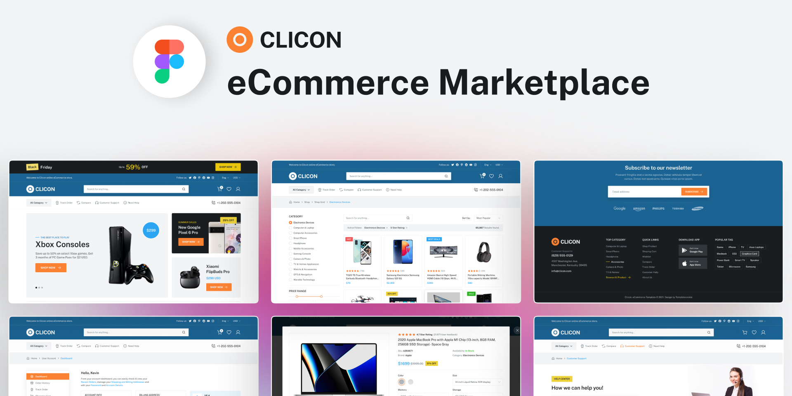

<div align="center">

# 🛒 CLICON - eCommerce Marketplace Website

**Giao diện Website Thương mại Điện tử hiện đại, chuẩn Pixel-Perfect theo thiết kế Figma**

<p align="center">
  
  
  
  
  
</p>

---

<p align="center">
  <a href="https://www.figma.com/design/m3x9CJOrYLs4uyF06rRrFo/Clicon---eCommerce-Marketplace-Website-Figma-Template--Community---Community-?node-id=2402-8087&t=l3nxsjDDpkFqMaNB-1" target="_blank">
    
  </a>
</p>

<br>

<p align="center">
  
</p>

</div>

---

## 🌟 Giới thiệu (Overview)

**Clicon** là dự án xây dựng giao diện website nền tảng Thương mại điện tử (eCommerce Marketplace) chuẩn theo bản thiết kế **Figma Community Template**. Dự án tập trung vào trải nghiệm người dùng hiện đại (UI/UX), bố cục linh hoạt, tương tác mượt mà và tối ưu khả năng hiển thị trên nhiều độ phân giải màn hình.

### 🔗 Liên kết thiết kế Figma
> **Figma Design Template:** [Clicon — eCommerce Marketplace Website Figma Template (Community)](https://www.figma.com/design/m3x9CJOrYLs4uyF06rRrFo/Clicon---eCommerce-Marketplace-Website-Figma-Template--Community---Community-?node-id=2402-8087&t=l3nxsjDDpkFqMaNB-1)

---

## 📄 Pages List

- Home (Landing Page)
- Shop (Product Page)
- Product Details
- About
- Account Setting
- Sign In
- Sign Up
- Forget Password
- Change Password
- 404
- Checkout
- Cart
- Wishlist

---

## 🛠️ Công nghệ sử dụng (Tech Stack)

| Công nghệ | Mô tả chi tiết |
| :--- | :--- |
| **HTML5** | Xây dựng cấu trúc Semantic HTML chuẩn SEO và dễ đọc |
| **CSS3** | Sử dụng Flexbox, CSS Grid, Custom Variables & tổ chức file theo Module |
| **Vanilla JavaScript** | Xử lý các tương tác giao diện người dùng (Banner, Header, Slider) |
| **Phosphor Icons** | Bộ icon vector hiện đại, sắc nét tích hợp qua CDN |

---

## 📂 Cấu trúc thư mục (Project Structure)

```text
ecommerce/
│
├── 📁 assets/
│   └── 📁 images/
│       ├── Thumbnail.jpg          # Ảnh đại diện dự án (Figma Preview)
│       ├── xbox-console.png       # Hình ảnh Xbox Console Banner
│       ├── google-pixel.png       # Hình ảnh Google Pixel 6 Pro Banner
│       └── xiaomi-buds.png        # Hình ảnh Xiaomi FlipBuds Pro Banner
│
├── 📁 css/
│   ├── components.css             # Style chung cho các component nhỏ
│   ├── header.css                 # Style cho Top Banner, Top Header, Main Header & Nav
│   ├── hero.css                   # Style cho khu vực Hero Banner & Services Bar
│   └── style.css                  # Style tổng thể & reset CSS
│
├── 📁 js/
│   ├── header.js                  # Script xử lý tương tác khu vực Header
│   ├── top-banner.js              # Script đóng/mở Top Promotional Banner
│   └── test.js                    # File script kiểm thử
│
├── 📄 index.html                  # Trang chủ eCommerce (Main Landing Page)
└── 📄 README.md                   # Tài liệu mô tả dự án
```

---

## 🚀 Hướng dẫn cài đặt & Sử dụng (Getting Started)

### 1. Sao chép kho lưu trữ (Clone the repo)
Mở Terminal / Git Bash và thực hiện lệnh sau:
```bash
git clone https://github.com/<your-username>/<your-repository-name>.git
cd ecommerce
```

### 2. Chạy ứng dụng (Run locally)
- **Cách 1: Mở trực tiếp trình duyệt**
  - Nhấp đúp vào file `index.html` trong thư mục dự án để xem ngay trên trình duyệt (Chrome, Edge, Firefox, Safari,...).
- **Cách 2: Sử dụng Live Server (VS Code)**
  - Cài đặt tiện ích **Live Server** trong Visual Studio Code.
  - Nhấp chuột phải vào file `index.html` và chọn **"Open with Live Server"**.
  - Trình duyệt sẽ tự động khởi chạy tại đường dẫn: `http://127.0.0.1:5500/index.html`.

---

## 🎨 Nguồn tham khảo & Bản quyền (Credits & License)

- **Figma Design:** Bản quyền mẫu thiết kế thuộc về tác giả trên **Figma Community**: [Clicon — eCommerce Marketplace Website Template](https://www.figma.com/design/m3x9CJOrYLs4uyF06rRrFo/Clicon---eCommerce-Marketplace-Website-Figma-Template--Community---Community-?node-id=2402-8087&t=l3nxsjDDpkFqMaNB-1).
- **Icons:** Sử dụng thư viện icon mã nguồn mở [Phosphor Icons](https://phosphoricons.com/).

---

<div align="center">
  <p>Được phát triển với ❤️ cho cộng đồng lập trình & thiết kế Front-End.</p>
</div>
